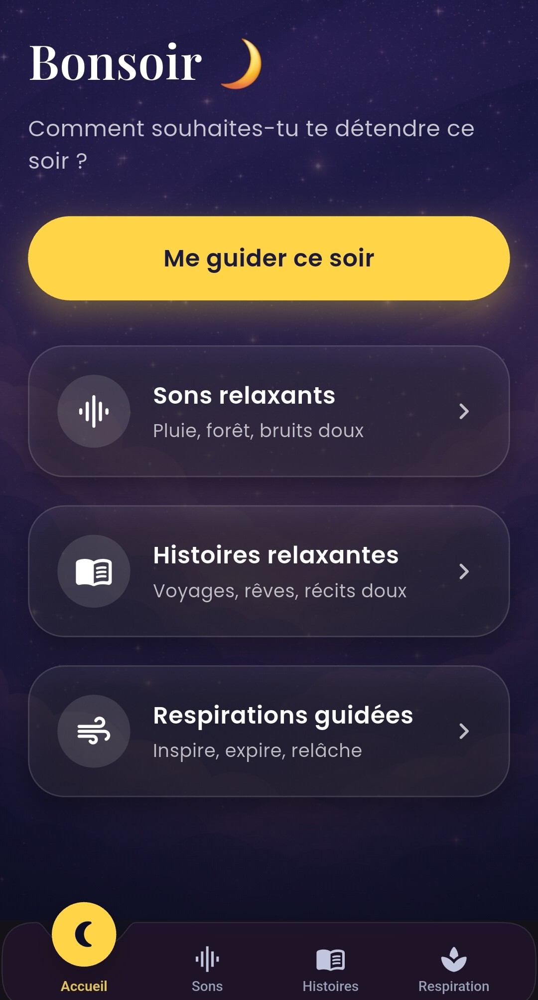
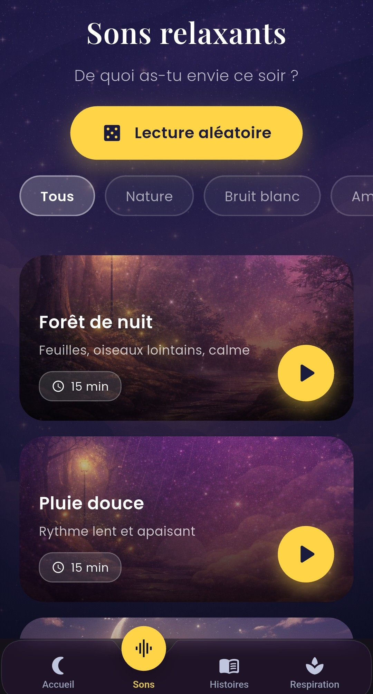
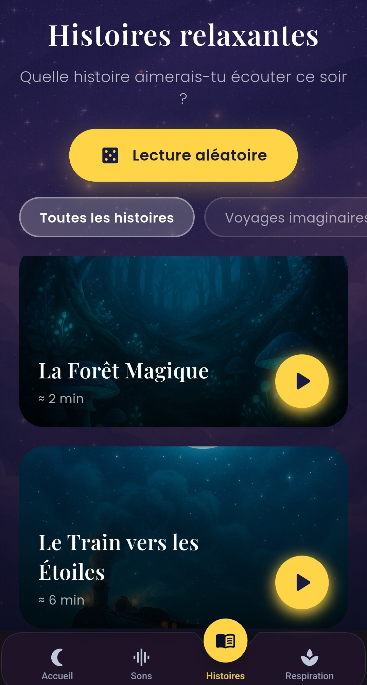
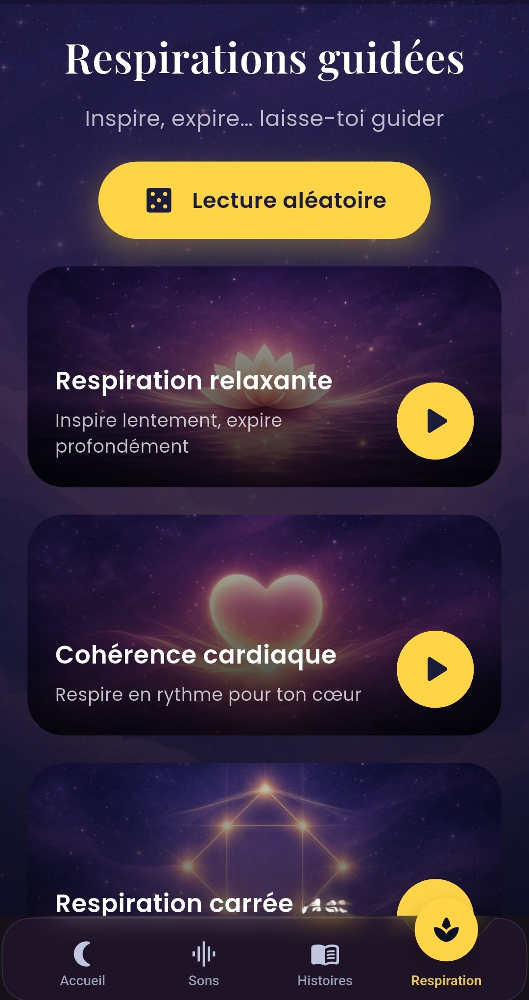
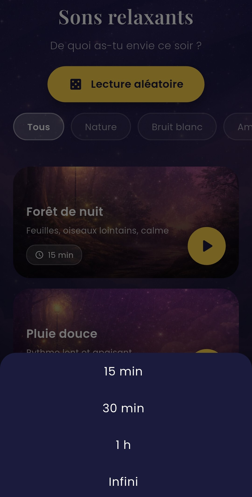
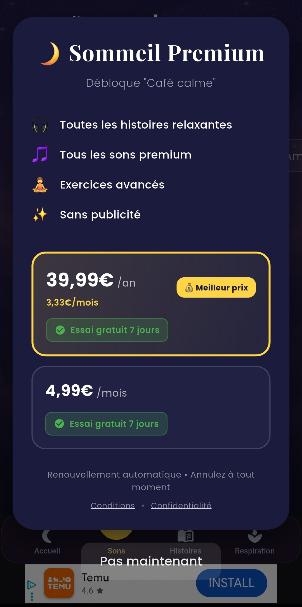

# 🌙 Sommeil Profond – Relax  
**Application mobile de bien-être & sommeil – Projet personnel**

Sommeil Profond – Relax est une application mobile développée dans un cadre **professionnel et autonome**, avec pour objectif de proposer une solution fiable, performante et orientée utilisateur pour la relaxation et l’amélioration du sommeil.

Ce projet met en avant mes compétences en **développement mobile**, **architecture applicative**, **gestion des abonnements** et **optimisation de l’expérience utilisateur**.

---

## 🎯 Objectifs du projet

- Concevoir une application mobile complète de bout en bout
- Mettre en production une application réelle sur le Play Store
- Implémenter un modèle économique (abonnements)
- Assurer stabilité, performance et maintenabilité du code
- Travailler sur l’expérience utilisateur (UX/UI) et le bien-être

---

## 🚀 Fonctionnalités principales

- 🎧 **Sons relaxants**
  - Gestion audio locale optimisée
  - Lecture en continu, faible consommation mémoire

- 📖 **Histoires relaxantes**
  - Contenu audio narratif pour l’endormissement
  - Expérience immersive orientée relaxation
 
## 📸 Screenshots

| Accueil | Sons relaxants | Histoires relaxantes |
|--------|----------------|---------------------|
|  |  |  |

| Respiration | Minuteur | Premium |
|------------|----------|---------|
|  |  |  |
    

- 🌬️ **Exercices de respiration guidée**
  - Logique temporelle et animations synchronisées

- ⏱️ **Minuteur intelligent**
  - Arrêt automatique des sons
  - Gestion du cycle de vie de l’application

- ⭐ **Système Premium**
  - Abonnements mensuel et annuel
  - Période d’essai
  - Gestion des droits utilisateurs (premium / free)

- 📢 **Monétisation**
  - Publicités intégrées de manière non intrusive
  - Séparation claire free / premium

---

## 🧠 Compétences techniques démontrées

- Architecture Flutter modulaire et maintenable
- Gestion avancée de l’audio
- Implémentation des **In-App Purchases (Google Play Billing)**
- Gestion des états et du cycle de vie
- Optimisation des performances
- Respect des guidelines Google Play
- Mise en production et suivi post-publication

---

## 🛠️ Stack technique

- **Flutter / Dart**
- **Google Play Billing (Subscriptions)**
- **Google AdMob**
- **Shared Preferences**
- **Gestion audio locale**
- **Android (Play Store)**

---

## 📱 Publication

- Application publiée sur le **Google Play Store**
- Versioning, tests et conformité respectés  
*(Lien disponible sur demande)*

---

## 🔒 Code source

Le code source est **privé**.  
Ce dépôt public sert de **vitrine professionnelle** pour présenter le projet, les choix techniques et les compétences mises en œuvre.

---

## 👤 À propos du développeur

Développeur avec une forte orientation **technique et produit**, habitué à travailler sur :
- applications mobiles
- automatisation
- qualité et fiabilité logicielle
- projets livrés et utilisés en conditions réelles

Disponible pour :
- missions **freelance**
- collaborations techniques
- projets mobiles Flutter

---

## 📬 Contact

📧 **Email** : saoussenr.pro@gmail.com  
💼 **LinkedIn** : Saoussen Rzig
🌐 **Portfolio / GitHub** : [lien](https://github.com/SaoussenBayar/sommeil-profond-presentation)

---

## 🙏 Remerciements

Merci pour votre temps et votre intérêt pour ce projet.  
Ce dépôt illustre mon approche du développement : **fonctionnel, structuré et orienté utilisateur**.
